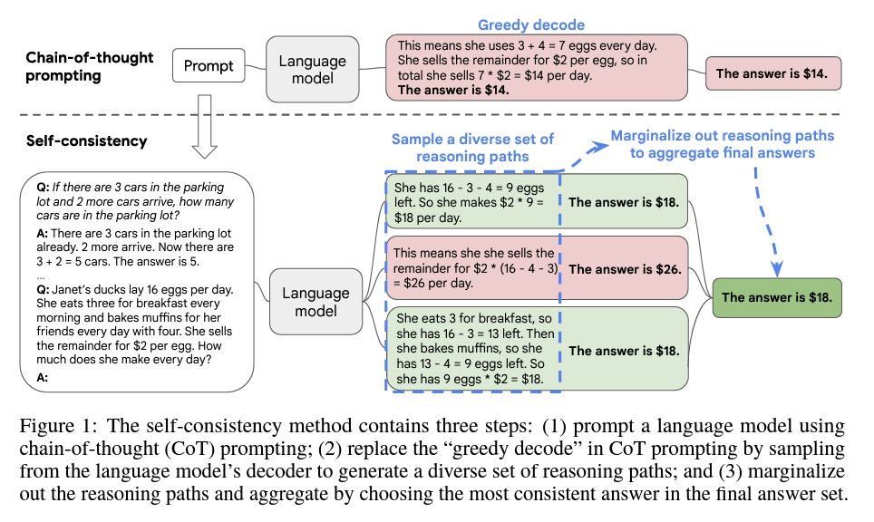
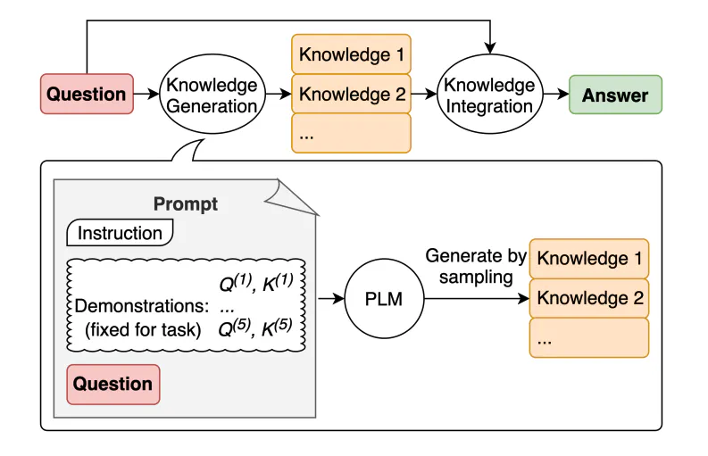
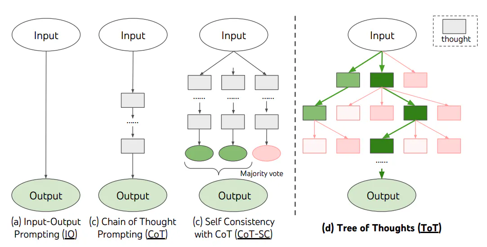
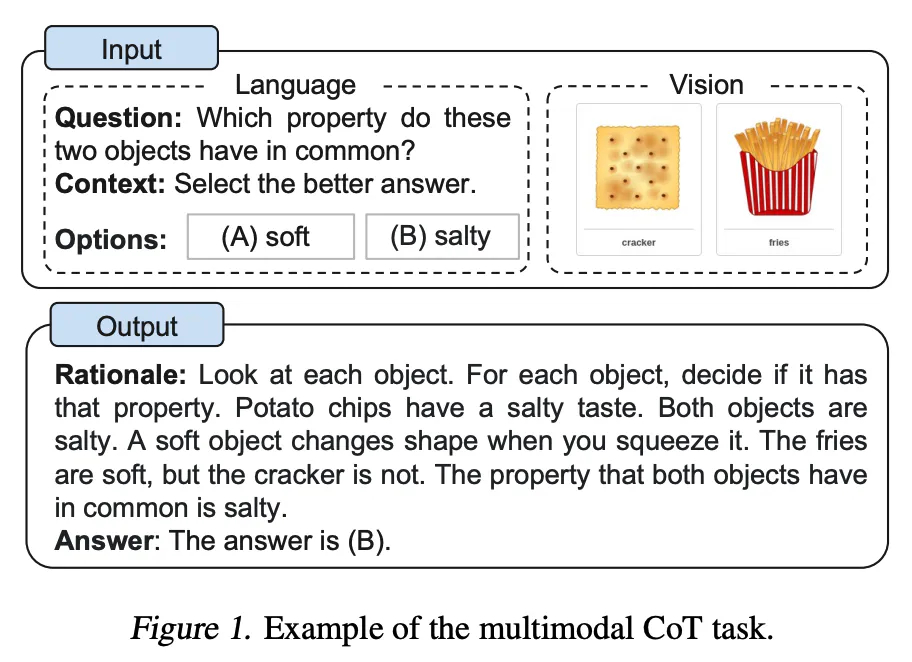

# Prompt Engineering

## Modality
Modality refers to the way in which something exists, is experienced, or is expressed. In the context of machine learning (ML) and artificial intelligence, modality specifically refers to a data type. Examples of data modalities include:
 - Text
 - Images
 - Audio
 - Video

### Multimodal AI System
multimodal architectures that can integrate and process multiple modalities simultaneously have the potential to produce more than one type of output.

## AI Agent
any system that tasks a language model with controlling a looping workflow and takes actions.

## Reasoning and Action (ReAct) style design
ReAct is a general paradigm that combines reasoning and acting with LLMs. ReAct prompts LLMs to generate verbal reasoning traces and actions for a task. This allows the system to perform dynamic reasoning to create, maintain, and adjust plans for acting while also enabling interaction to external environments (e.g., Wikipedia) to incorporate additional information into the reasoning.  
A basic loop with the following steps:
1. reason and plan actions to take
2. take actions using tools (regular software functions)
3. observe the effects of the tools and re-plan or react as appropriate

## Techniques
### Zero-Shot Prompting
the prompt used to interact with the model won't contain examples or demonstrations. The zero-shot prompt directly instructs the model to perform a task without any additional examples to steer it.
when zero-shot doesn't work, it's recommended to provide demonstrations or examples in the prompt which leads to few-shot prompting.

### Few-Shot Prompting
a technique to enable in-context learning where we provide demonstrations in the prompt to steer the model to better performance. The demonstrations serve as conditioning for subsequent examples where we would like the model to generate a response.
but few-shot prompting is not enough to get reliable responses for this type of reasoning problem.

### Chain-Of-Thought(COT) Prompting

enables complex reasoning capabilities through intermediate reasoning steps.  
Chain of Thought는 복잡한 추론 작업을 수행하기 위해 중간 추론 과정을 순차적으로 연결한 것이다. 중간 추론 단계의 연속성과 유창한 표현이 중요하며, 최종 결과를 유도하기 위한 과정을 포함한다

### Zero-Shot COT Prompting

adding "Let's think step by step" to the original prompt.

### Automatic Chain-of-Thought (Auto-CoT)

when applying chain-of-thought prompting with demonstrations, the process involves hand-crafting effective and diverse examples. This manual effort could lead to suboptimal solutions. Auto-CoT proposes an approach to eliminate manual efforts by leveraging LLMs with "Let's think step by step" prompt to generate reasoning chains for demonstrations one by one.  
Auto-CoT consists of two main stages:
- 1: question clustering: partition questions of a given dataset into a few clusters.
- 2: demonstration sampling: select a representative question from each cluster and generate its reasoning chain using Zero-Shot-CoT with simple heuristics.
(examples of herustics : length of questions (e.g., 60 tokens) and number of steps in rationale (e.g., 5 reasoning steps).)

### Self-Consistency

the idea is to sample multiple, diverse reasoning paths through few-shot CoT, and use the generations to select the most consistent answer. This helps to boost the performance of CoT prompting on tasks involving arithmetic and commonsense reasoning.  
복잡한 추론 작업에서 여러 추론 경로를 통해 얻은 다양한 답변 중에서 가장 일관된 답변을 선택하여 모델의 추론 능력을 향상시키는 방법

### Generated Knowledge Prompting

can the model also be used to generate knowledge before making a prediction? - generate knowledge to be used as part of the prompt.

### Prompt Chaining
to improve the reliability and performance of LLMs, one of the important prompt engineering techniques is to break tasks into its subtasks. Once those subtasks have been identified, the LLM is prompted with a subtask and then its response is used as input to another prompt. This is what's referred to as prompt chaining, where a task is split into subtasks with the idea to create a chain of prompt operations.
in prompt chaining, chain prompts perform transformations or additional processes on the generated responses before reaching a final desired state. also prompt chaining helps to boost the transparency of your LLM application, increases controllability, and reliability. This means that you can debug problems with model responses much more easily and analyze and improve performance in the different stages that need improvement.

### Tree of Tought

this approach enables an LM to self-evaluate the progress through intermediate thoughts made towards solving a problem through a deliberate reasoning process. The LM's ability to generate and evaluate thoughts is then combined with search algorithms (e.g., breadth-first search and depth-first search) to enable systematic exploration of thoughts with lookahead and backtracking.
for example, to perform BFS in ToT for the Game of 24 task, the LM is prompted to evaluate each thought candidate as "sure/maybe/impossible" with regard to reaching 24. As stated by the authors, "the aim is to promote correct partial solutions that can be verdicted within few lookahead trials, and eliminate impossible partial solutions based on "too big/small" commonsense, and keep the rest "maybe"". Values are sampled 3 times for each thought. The process is illustrated below:

### Retrieval Augmented Generation(RAG)
RAG takes an input and retrieves a set of relevant/supporting documents given a source (e.g., Wikipedia). The documents are concatenated as context with the original input prompt and fed to the text generator which produces the final output. This makes RAG adaptive for situations where facts could evolve over time. This is very useful as LLMs's parametric knowledge is static. RAG allows language models to bypass retraining, enabling access to the latest information for generating reliable outputs via retrieval-based generation.  
RAG는 사전 훈련된 언어 모델에 검색 기능을 결합한 형태, 즉 지식 기반 생성 작업을 위한 알고리즘입니다. 이는 사용자 요청과 관련된 고유한 문서를 검색하여, 해당 문서를 기반으로 언어 모델이 답변을 생성하도록 하는 방식입니다. 따라서, RAG는 자연어 처리 과제에 있어 심층적인 지식을 필요로 하는 문제에서 특히 유용합니다.

### Automatic Reasoning and Tool-use (ART)
combining CoT prompting and tools in an interleaved manner has shown to be a strong and robust approach to address many tasks with LLMs. These approaches typically require hand-crafting task-specific demonstrations and carefully scripted interleaving of model generations with tool use.  
ART is a new framework that uses a frozen LLM to automatically generate intermediate reasoning steps as a program.  
ART works as follows:  
1. given a new task, it select demonstrations of multi-step reasoning and tool use from a task library
2. at test time, it pauses generation whenever external tools are called, and integrate their output before resuming generation.

언어모델이 새로운 작업을 수행하기 위해 스스로 중간 추론 단계를 생성하고 외부 도구를 사용하는 방법. 예를 들면, 
1. 사용자의 질문을 분석한다.
2. 사용자의 요청을 해결할 최적의 추론 경로와 외부 도구가 무엇인지 탐색한다.
3. 최적의 추론 경로와 외부 도구를 활용하여 문제를 해결한다.
4. 필요에 따라 사용자가 외부 도구 라이브러리를 추가하거나 수정한다.

참고사항: 논문에서 소개하는 대표적인 외부 도구들
 - GSM8K: 고품질의 언어학적으로 다양한 초등학교 수학 단어 문제 8,500개 데이터 세트. 데이터셋은 다단계 추론이 필요한 기초 수학 문제에 대한 질문 답변 과제를 지원하기 위해 제작되었다.
 - SVAMP: GSM8K와 같이 초등 수준의 수학 문제 데이터 세트
 - AQuA: 딥러닝 기술의 상태를 시험하기 위한 객관식 대수 단어 문제
 - StrategyQA: 필요한 추론 단계가 질문에 내포되어 있고 전략을 사용하여 추론해야 하는 질문 답변 벤치마크입니다. 2,780개의 예제가 포함되어 있으며, 각각은 전략 질문, 분해 및 증거 단락으로 구성되어 있습니다.
 - ARC-challenge: 과학 시험의 객관식 문제 데이터 세트

 ### ReAct Prompting
 
ReAct is a framework where LLMs are used to generate both reasoning traces and task-specific actions in an interleaved manner.  
 - Reasoning : generating reasoning traces allow the model to induce, track, and update action plans, and even handle exceptions.
 - Action : the action step allows to interface with and gather information from external sources such as knowledge bases or environments.
 
the ReAct framework can allow LLMs to interact with external tools to retrieve additional information that leads to more reliable and factual responses. ReAct prompts LLMs to generate verbal reasoning traces and actions for a task. This allows the system to perform dynamic reasoning to create, maintain, and adjust plans for acting while also enabling interaction to external environments (e.g., Wikipedia) to incorporate additional information into the reasoning. 

### Multimodal CoT Prompting

traditional CoT focuses on the language modality. In contrast, Multimodal CoT incorporates text and vision into a two-stage framework. The first step involves rationale generation based on multimodal information. This is followed by the second phase, answer inference, which leverages the informative generated rationales.

## Reference
https://www.promptingguide.ai/techniques/pal

https://langchain-ai.github.io/langgraph/concepts/
https://langchain-ai.github.io/langgraph/tutorials/introduction/
