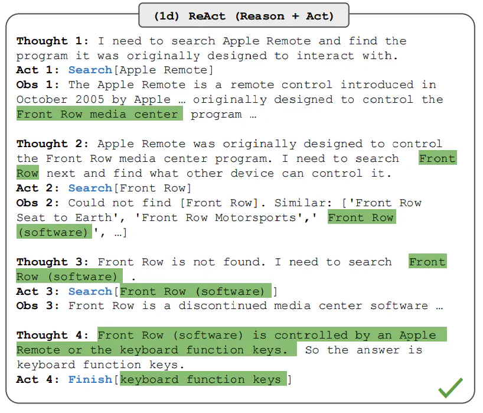

# Prompt Engineering

## AI Agent
any system that tasks a language model with controlling a looping workflow and takes actions.

## Reasoning and Action (ReAct) style design
ReAct is a general paradigm that combines reasoning and acting with LLMs. ReAct prompts LLMs to generate verbal reasoning traces and actions for a task. This allows the system to perform dynamic reasoning to create, maintain, and adjust plans for acting while also enabling interaction to external environments (e.g., Wikipedia) to incorporate additional information into the reasoning.  
A basic loop with the following steps:
1. reason and plan actions to take
2. take actions using tools (regular software functions)
3. observe the effects of the tools and re-plan or react as appropriate

## Technique
### Zero-Shot Prompting
the prompt used to interact with the model won't contain examples or demonstrations. The zero-shot prompt directly instructs the model to perform a task without any additional examples to steer it.
when zero-shot doesn't work, it's recommended to provide demonstrations or examples in the prompt which leads to few-shot prompting.

### Few-Shot Prompting
a technique to enable in-context learning where we provide demonstrations in the prompt to steer the model to better performance. The demonstrations serve as conditioning for subsequent examples where we would like the model to generate a response.
but few-shot prompting is not enough to get reliable responses for this type of reasoning problem.

### Chain-Of-Thought(COT) Prompting

enables complex reasoning capabilities through intermediate reasoning steps.

### Zero-Shot COT Prompting

adding "Let's think step by step" to the original prompt.

### Automatic Chain-of-Thought (Auto-CoT)

when applying chain-of-thought prompting with demonstrations, the process involves hand-crafting effective and diverse examples. This manual effort could lead to suboptimal solutions. Auto-CoT proposes an approach to eliminate manual efforts by leveraging LLMs with "Let's think step by step" prompt to generate reasoning chains for demonstrations one by one.  
Auto-CoT consists of two main stages:
- 1: question clustering: partition questions of a given dataset into a few clusters.
- 2: demonstration sampling: select a representative question from each cluster and generate its reasoning chain using Zero-Shot-CoT with simple heuristics.
(examples of herustics : length of questions (e.g., 60 tokens) and number of steps in rationale (e.g., 5 reasoning steps).)

## Reference
https://www.promptingguide.ai/techniques/pal

https://langchain-ai.github.io/langgraph/concepts/
https://langchain-ai.github.io/langgraph/tutorials/introduction/
