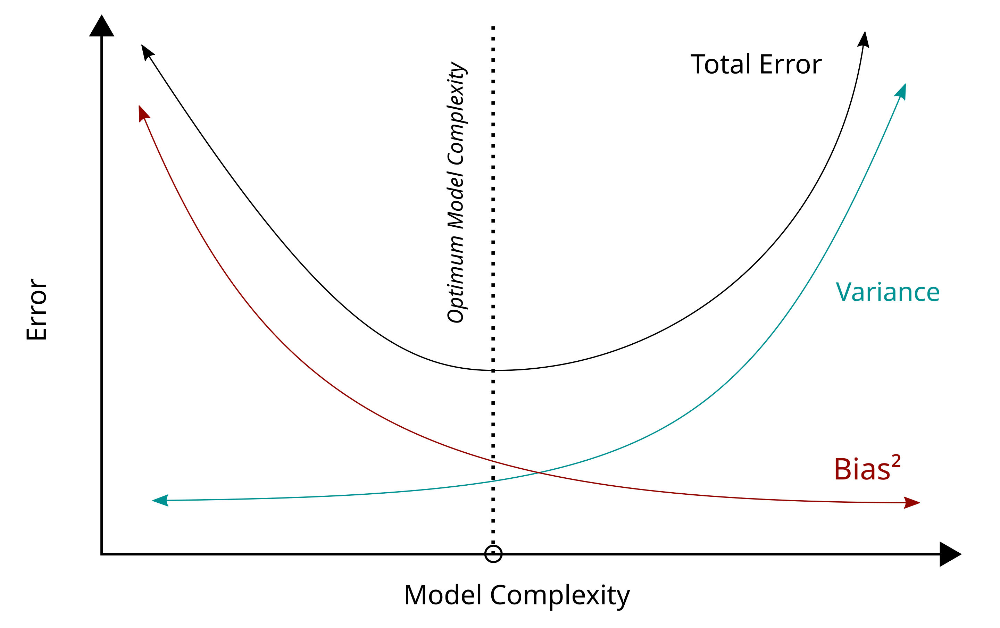

# Learning Theory

## Bias and Variance (Trade Off)

The bias–variance tradeoff describes the relationship between a model's complexity, the accuracy of its predictions, and how well it can make predictions on previously unseen data that were not used to train the model.
As the number of tunable parameters increase in a model, it becomes more flexible, and can better fit a training data set. It is said to have lower error, or $\text{Bias}$.  
However, for more flexible models, there will tend to be greater $\text{Variance}$ to the model fit each time we take a set of samples to create a new training data set.

### Bias
The bias error is an error from erroneous assumptions in the learning algorithm. High bias can cause an algorithm to miss the relevant relations between features and target outputs (underfitting).

### Variance
The variance is an error from sensitivity to small fluctuations in the training set. High variance may result from an algorithm modeling the random noise in the training data (overfitting).

## Regularization
https://www.geeksforgeeks.org/regularization-in-machine-learning/
https://en.wikipedia.org/wiki/Regularization_(mathematics)

Adding incentive term to make the parameter theta smaller. (when minimizing theta) and make parameter theta bigger when maximizaing theta.

### L1 Regularization
L1 regularization (also called LASSO) leads to sparse models by adding a penalty based on the absolute value of coefficients.
### L2 Regularization
L2 regularization (also called ridge regression) encourages smaller, more evenly distributed weights by adding a penalty based on the square of the coefficients.

## Cross Validation
Cross validation is a technique used in machine learning to evaluate the performance of a model on unseen data. It involves dividing the available data into multiple folds or subsets, using one of these folds as a validation set, and training the model on the remaining folds. This process is repeated multiple times, each time using a different fold as the validation set. Finally, the results from each validation step are averaged to produce a more robust estimate of the model’s performance. Cross validation is an important step in the machine learning process and helps to ensure that the model selected for deployment is robust and generalizes well to new data.

### Purpose of Cross Validation
The main purpose of cross validation is to prevent overfitting, which occurs when a model is trained too well on the training data and performs poorly on new, unseen data. By evaluating the model on multiple validation sets, cross validation provides a more realistic estimate of the model’s generalization performance.

### Holdout Cross Validation (Train, Dev and Test Set)
You train on the training set, evaluate results on the dev set, and test on the test set. So do not test your model on the test set until you have finished handling overfitting.  
In short, 
1. Keep on fitting on train sets.
2. Evaluating and Optimizing the performance of your algorithm on dev sets. (Introducing new features, Choosing model size or regularization parameter...)
3. Want to know how well your algorithm is perforing -> evaluate the model on the test sets.

#### Relation between # of datasets and data split
- If you have to find out small differences in algorithm accuracy, you need large test sets. (e.g., 90.01% vs 90.00%)  
- Choose dev/test sets big enough to make meaningful comparion between different algorithm (90% vs 88%). 
- As the # of example increases, data you send to dev and test sets are shrinking.  
(1,000 example : 60%/20%/20%, 100,000,000,000 example : 98%/1%/1%)

### K-fold Cross Validation

In K-fold cross-validation, the data set is divided into a number of K-folds and used to assess the model’s ability as new data become available. K represents the number of groups into which the data sample is divided. For example, if you find the k value to be 5, you can call it 5-fold cross-validation. Each fold is used as a test set at some point in the process.

1. Randomly shuffle the dataset.
2. Divide the dataset into k folds
3. For each unique group:
4. Use one fold as test data
5-1. Use remaining groups as training dataset
5-2. Fit model on training set and evaluate on test set
Keep Score 
6. Get accuracy score by applying mean to all the accuracies received for all folds.

### Leave-One-Out Cross Validation
LOOCV(Leave One Out Cross-Validation) is a type of cross-validation approach in which each observation is considered as the validation set and the rest (N-1) observations are considered as the training set.  
In LOOCV, fitting of the model is done and predicting using one observation validation set. Furthermore, repeating this for N times for each observation as the validation set.  
This is a special case of K-fold cross-validation in which the number of folds is the same as the number of observations(K = N). 

## Feature Selection
Feature selection is the process of selecting a subset of relevant features (variables, predictors) for use in model construction.  

Keep on adding feature greedly one at a time to which single feature addition helps improve your algorithm the most until adding more features not hurt performance. Then pick whichever feature subsets allows you to have the best possible performance of dev sets.

Advantages:  
 - simplification of models to make them easier to interpret.
 - shorter training times.
 - to avoid the curse of dimensionality.
 - improve the compatibility of the data with a certain learning model class.
 - to encode inherent symmetries present in the input space.